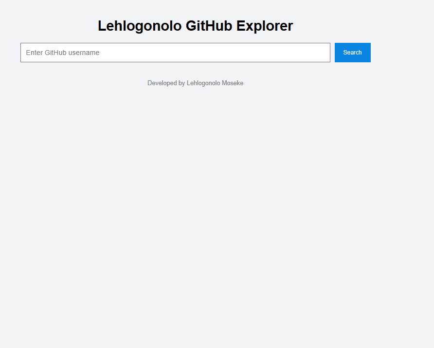
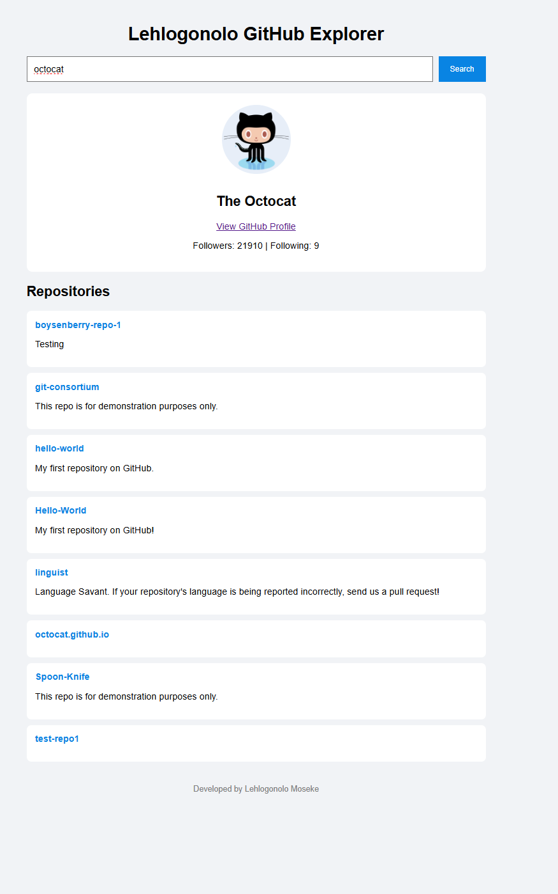

# GitHub Explorer – Codveda Technologies Internship (Level 2)

This project was developed as part of my Frontend Development Internship at Codveda Technologies under Level 2 Task: Single Page Application (SPA) and REST API Integration.

The application allows users to search for GitHub profiles and view their public repositories using the GitHub REST API.

---

## Live Repository

Repository Link:  
https://github.com/Lehlogonolomoseke/codveda-level2-react-github-user-explorer

---

## Features

• Search for any GitHub username  
• Display user profile information  
• Display public repositories  
• Loading indicator  
• Error handling  
• Responsive modern UI

---

## Technologies Used

• React (Vite)  
• JavaScript (ES6)  
• CSS3  
• GitHub REST API

---

## Project Structure

```
codveda-level2-react-github-user-explorer

src
│
├── components
│   ├── Search.jsx
│   ├── UserProfile.jsx
│   └── RepoList.jsx
│
├── services
│   └── githubService.js
│
├── styles
│   └── app.css
│
└── App.jsx

screenshots
```

---

## Screenshots

### Search Interface



---

### User Profile and Repository Display



---

## How to Run Project

Clone repository

```
git clone https://github.com/Lehlogonolomoseke/codveda-level2-react-github-user-explorer.git
```

Go into folder

```
cd codveda-level2-react-github-user-explorer
```

Install dependencies

```
npm install
```

Run project

```
npm run dev
```

---

## Learning Outcomes

This project helped me strengthen my skills in:

• React development  
• API integration  
• Component-based architecture  
• State management  
• Error handling  
• Frontend project structuring

---

## Internship Information

Company: Codveda Technologies  
Role: Frontend Development Intern  
Level: Level 2

---

## Author

Lehlogonolo Moseke

BSc Information Technology (Computer Science & Informatics)

GitHub:  
https://github.com/Lehlogonolomoseke

LinkedIn:  
https://linkedin.com/in/lehlogonolo-moseke-474a8a280

---

## Project Status

Completed
