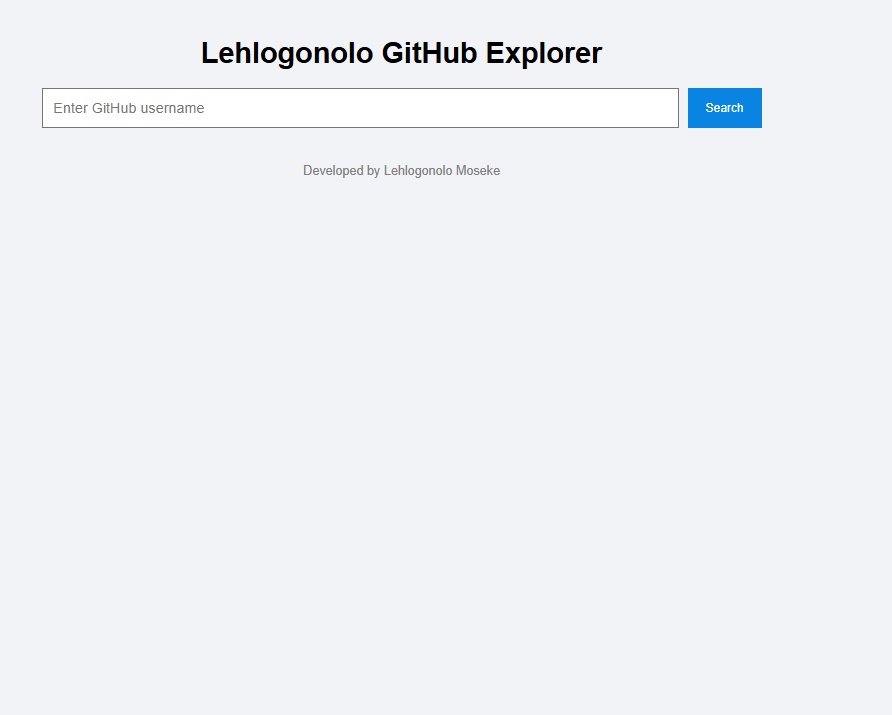
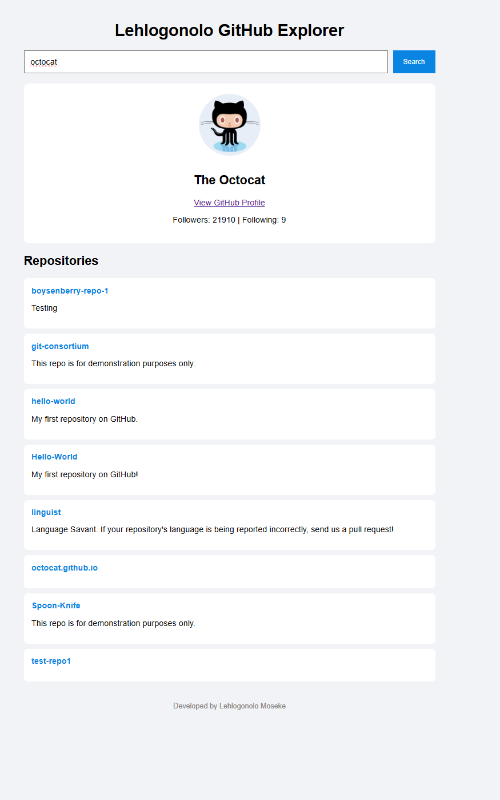

# GitHub Explorer – Codveda Technologies Internship (Level 2)

This project was developed as part of my Frontend Development Internship at **Codveda Technologies** under **Level 2 Task: Single Page Application (SPA) and REST API Integration**.

It is a modern React Single Page Application that integrates with the GitHub REST API to search users and dynamically display profile and repository information.

---

## 🚀 Repository Link

GitHub Repository:  
https://github.com/Lehlogonolomoseke/codveda-level2-react-github-user-explorer

---

## ✨ Features

- Search for any GitHub username
- Display user profile information
- Display public repositories
- Dynamic routing using React Router
- Loading indicator during API calls
- Error handling for invalid users
- Debounced search input
- Responsive modern UI
- Multi-page SPA (Home, About, Contact, Results)

---

## 🛠 Technologies Used

- React (Vite)
- React Router
- JavaScript (ES6+)
- CSS3
- GitHub REST API

---

## 📂 Project Structure

src
│
├── components
│ ├── Navbar.jsx
│ ├── Search.jsx
│ ├── UserProfile.jsx
│ ├── RepoList.jsx
│ ├── Loader.jsx
│ └── Error.jsx
│
├── pages
│ ├── Home.jsx
│ ├── About.jsx
│ ├── Contact.jsx
│ └── User.jsx
│
├── services
│ └── githubService.js
│
├── styles
│ └── app.css
│
├── App.jsx
└── main.jsx

---

## 📸 Screenshots

### Search Interface

### User Profile and Repository Display

---

## ⚙ How It Works

1. User enters a GitHub username.
2. The app sends a request to the GitHub REST API.
3. Profile and repository data are fetched dynamically.
4. Loading and error states are handled gracefully.
5. Results are displayed without page reload (SPA behavior).

---

## ▶ How to Run Locally

Clone the repository:
git clone https://github.com/Lehlogonolomoseke/codveda-level2-react-github-user-explorer.git

Navigate into the folder: Navigate into the folder: cd codveda-level2-react-github-user-explorer

Install dependencies: npm install

Run the development server: npm run dev

---

## 🎓 Learning Outcomes

This project strengthened my understanding of:

- Building Single Page Applications with React  
- Integrating REST APIs  
- Managing asynchronous data  
- Implementing dynamic routing  
- Handling loading and error states  
- Structuring scalable frontend applications  

---

## 🏢 Internship Information

Company: Codveda Technologies  
Role: Frontend Development Intern  
Level: Level 2  

---

## 👨‍💻 Author

Lehlogonolo Moseke  

BSc Information Technology (Computer Science & Informatics)

GitHub:  
https://github.com/Lehlogonolomoseke  

LinkedIn:  
https://linkedin.com/in/lehlogonolo-moseke-474a8a280  

---

## 📌 Status

Completed

